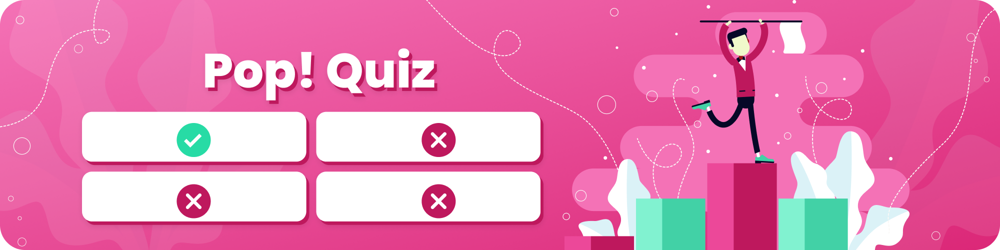

### 

> Build your own set of quizzes and compete with others to be the smartest in the room!

## How to play

### TL;DR

- As host: build your question set, share the URL or game ID to your players, and start the quiz! 
- As player: enter the game ID, answer the question, and win! 

### As Host

- Create a new room and enter your username. 

- Build your question set by adding questions (don't forget to click save!)

- Choose one of three question types:

  - Multiple choice: players are given four options to choose from, there is only one correct answer.
  - True of False: players are given two options (normally true or false, but these can be changed), there is one correct answer.
  - Short Answer: players are to type their own answer, there may be multiple versions of the correct answer.

- Choose the time limit to answer each question. The player cannot answer after the time is up.

- Choose point rewards for each question: 

  - Default: players are rewarded 200 base points for any correct answer and additional time-bonus points up to 200, with a maximum total of 400 points for each question. 

  - Double Points: same calculations as above, multiplied 2x with a maximum total of 800 points for each question.
  - No Points: players will not be rewarded any points for answering this question.   

- Host can import/export the question set as JSON file to use again for later. 

- When everything is set up, click **START** to start accepting players.

- Share the link/gameID provided on the platform/screen so players can join the room. When everyone is ready, click **Start Quiz**.

- The screen will display questions entered from before. `Clicking Next here will skip the current question and move on to the next.`

- After the time is up, the correct answer will be revealed and the top 5 players with the most points are displayed. Click **Next** to continue to the next question. 

  - For **Short Answer** types, the players' wrong answers will be displayed. The host may mark close answers as correct, and the player will be rewarded points as normal. 

- When the question set is over, the final leaderboard and the overall winner will be shown.

### As Player

- Enter the Game ID given by your host and a username to enter the quiz room. Wait for the host to start quiz. 
- Answer the questions by clicking the options or typing in the input bar. 
- The faster you answer, the bigger your point rewards.
- Answer as many questions and be the winner!
